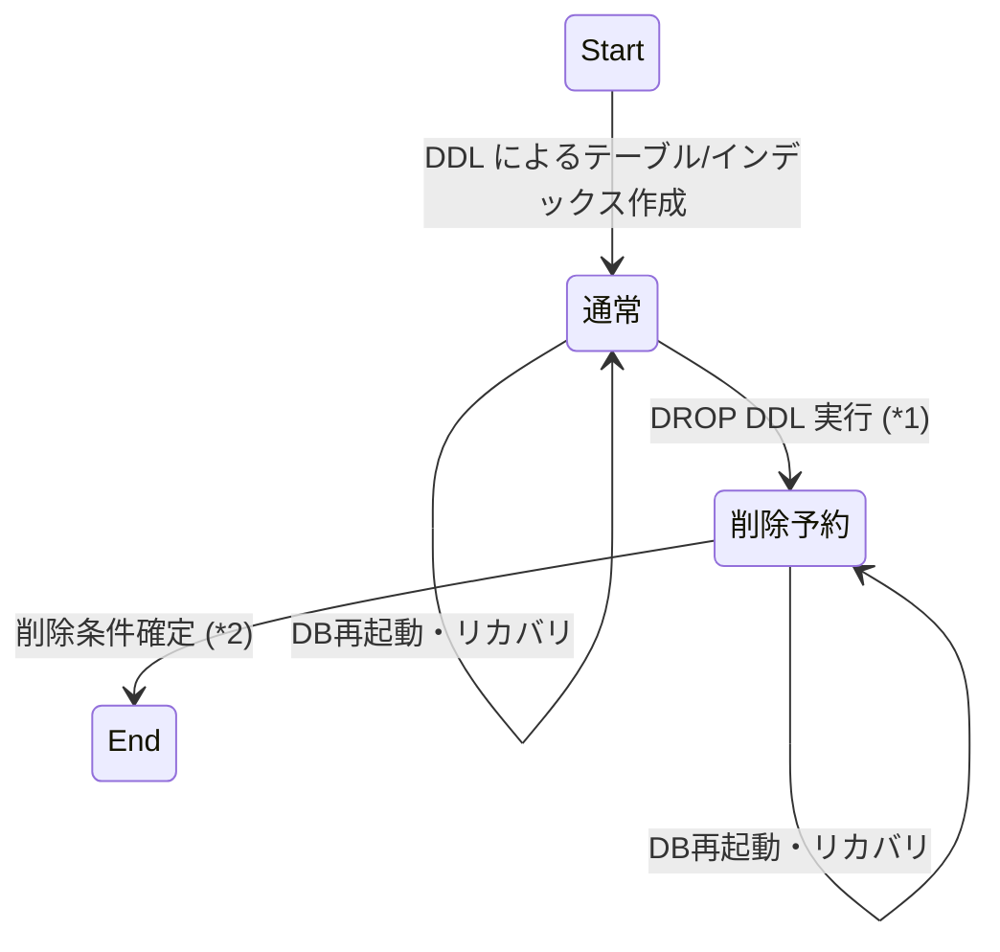

# ストレージ遅延削除の設計

2026-03-10 kurosawa

## 本文書について

tsurugi-issues #177 の修正設計を記述する。DMLが使用中のストレージをDDLで削除した際にshirakamiがクラッシュする問題に対処するため、ストレージの削除を参照カウンタに基づいて遅延させる仕組みを設計する。

## 背景・問題

- DROP TABLE, DROP INDEX は shirakami の `delete_storage` を呼び出してストレージの削除を行う
- `delete_storage` はストレージを即座に削除するが、その時点で稼働中のトランザクションがそのストレージをまだ参照している場合、shirakami 内部で問題が生じる

### 既存の対策とその限界

- tsurugi-issues #1230 の修正により、DDL を実行すると操作対象インデックスに対するロックが DDL を実行したトランザクションの完了時点まで保持されるようになった
  - 詳細は [ddl-dml-interaction.md](ddl-dml-interaction.md) を参照
- これにより「DROP TABLE/INDEX の後に DML でそのテーブル/インデックスを使おうとする」ケースは排除できる
- しかし「DML がすでに使用中のテーブル/インデックスを別トランザクションの DDL で削除する」ケースは保護できていない
  - DML の共有ロックはステートメント完了時に解放されるため、DROP TABLE 実行時点ではすでに共有ロックが手放されているトランザクションでも、shirakami 側では内部的にそのストレージを参照し続けている可能性がある
  - この状態で `delete_storage` を呼び出すと問題が起きる

## 実装方針

- ストレージに参照カウンタを導入し、参照中のトランザクションが存在する場合は `delete_storage` の実行を遅延させる。
- jogasakiにメンテナンススレッドを導入し、定期的に参照カウンタをチェックし、参照カウンタが 0 になったストレージの削除処理を検討する
- 参照カウンタはプライマリインデックスに対するストレージについて行う。セカンダリインデックスの参照はプライマリインデックスの参照も必要になるため、プライマリインデックスの参照カウンタが 0 であればセカンダリインデックスも安全に削除できると判断する 

### データ構造

#### ストレージとトランザクション間の参照カウント

- jogasaki が管理するストレージエントリ( `storage_control` )に「何件のトランザクションから使用中か」を表す参照カウンタを追加する
  - 「何件のリクエストから使用中か」を表す既存のカウンタ(`storage_control::state_` の `read_lock_count` ) とは別に必要
- トランザクションに「このトランザクションが使用したストレージ」のセットを記憶させる
  - セカンダリインデックスを使用する場合はそのインディックスに対応するストレージではなく、ベーステーブル(プライマリインデックス)のストレージを記憶させる
 
#### ストレージの削除予約フラグ

- jogasaki が管理するストレージエントリ( `storage_control` )に「削除予約フラグ」を追加する

- また、永続化情報として、ストレージメタデータにも削除予約フラグを追加する ( `delete_reserved` )

```
message IndexDefinition {

    ...
    ...
    ...

    // Whether the index deletion is reserved for backround processing. 
    // This indicates the index is being deleted by a DDL statement.
    bool delete_reserved = 60;

    ...
}
```

### DML ステートメントの実行時の処理

- DML ステートメントの実行開始時、そのステートメントが新規に使用する(プライマリインデックスの)ストレージごとに以下を行う
  - そのストレージをトランザクションの使用済みストレージセットに追加する（同一ストレージは1件のみ記録）
  - ストレージエントリの参照カウンタをインクリメントする
  - DML が使用するストレージは `mirror_container::storage_operation().storage()` で取得できる
    - 権限管理に使われていたものだが、権限管理もプライマリインデックスのストレージ単位で行っているため、DMLがアクセスするテーブルという今回の用途と完全に一致する 
  - トランザクションが使用するストレージを記憶するためのクラス `storage::reference_scope` (詳細は下記) を新設し、`transaction_context` に `std::unique_ptr<storage::reference_scope>` をとして追加する    

### DROP DDLの実行時の処理

- storage metadata に削除予約フラグを設定する ( `delete_reserved = true` )
  - DROP TABLEしてすぐクラッシュした場合でもこのフラグをもとに削除予約済みストレージを特定できるようにするため
- 削除予約済みストレージは、新規に DML から使用されないようにする
  - ストレージ名/ストレージキーによる検索でヒットしないよう jogasaki 内のストレージ管理マップから除外する
    - 具体的には `storage_manager` の `storage_names_` から削除する
    - `storages_` からは削除せず、`storage_control` の削除予約フラグを立てるだけにする
    - 同時に `storage_control` の `name_` フィールドを `std::nullopt` にする (name_の型は `std::optional<std::string>` に変更する)
- 順序としては、名前の抹消処理を行った後に、削除予約フラグを設定する
  - 逆になると、削除予約をしたものが再度使用開始される可能性があるため
- 削除予約フラグを設定後もそのストレージに対する write lock は維持する
  - これまでは DROP実行のタイミングで storage entry が削除され write lock が解放されてしまっていたが厳密な想定挙動ではなかった
    - 削除予約状態では storage entry は残るため、DROP を実行したトランザクションの完了まで正しく write lock を保持できるようになる

### トランザクション完了時の処理

- トランザクションのコミットまたはアボート完了時に、トランザクションが記憶している使用済みストレージを対象に各ストレージエントリの参照カウンタをデクリメントする
  - 実際には `transaction_context` が保持する `storage::reference_scope` を破棄することによりそのデストラクタで行う
- コミット時の `storage_ref_scope_` の解放タイミングは `storage_lock_`（テーブルに対する write lock）と同じタイミングで行う
- アボート時は KVS アボート完了直後に `storage_lock_` と一緒に解放する

### メンテナンススレッドの開始・停止

- jogasaki の起動時 (`database::start()`) にストレージメタデータから storage_managerを復旧させ、メンテナンススレッドを起動する
  - `delete_reserved = true` のストレージが存在する場合は、storage_managerのエントリを復活させる時点で名前をフィルしないようにする
    - 具体的には `storage_manager` の `storage_names_` にそのストレージのエントリを追加しない
- jogasaki のシャットダウン時 (`database::stop()`) にメンテナンススレッドにジョインして停止する
  - メンテナンススレッドが `shirakami::delete_storage()` を呼出中の場合、それを待つ必要がある
  - `shirakami::delete_storage()` の呼出前であればメンテナンススレッドを停止させ、シャットダウンを優先させてよい
    - 削除予約フラグが立っているものは再起動後に削除処理が行われるため、シャットダウン前に削除処理が完了していなくても問題ない

### メンテナンススレッドの処理

- 定期的(0.1秒程度ごと)に削除予約フラグが立っているストレージの参照カウンタをチェックし、削除可能になったストレージに対して `delete_storage` を実行する。
  - `delete_storage` はエラーにならないことを想定しているが、万一エラーになった場合はログメッセージを出力する
- 削除可能なストレージの条件は以下の通り
  - 削除予約フラグが立っていること
  - プライマリインデックスのストレージの場合、参照カウンタが 0 であること
  - セカンダリインデックスのストレージの場合、対応するプライマリインデックスのストレージの参照カウンタが 0 であるか、またはそのストレージエントリが削除済みであること 
    - 参照カウンタはプリマリインデックスのストレージ単位で管理し、セカンダリインデックスの参照状態は管理しないためこのような条件になる
    - これをおこなうために `storage_control` にプライマリストレージを探すための `storage_entry` を記憶する
    - 削除処理の順序は、セカンダリ -> プライマリの順になるとは限らず、プライマリが削除済みの場合は参照カウンタが 0 であるのと同じ状態とみなせる
    - 特別なケースとして、プライマリストレージが削除予約されたあとに recovery が起きた場合は名前からプライマリストレージが特定できないため、セカンダリストレージにプライマリストレージを関連付けることができないが、recovery 後は参照状態を追跡する必要がないため、セカンダリストレージはプライマリストレージの状態に関わらず削除可能としてよい
- `delete_storage` の実行完了時に `storages_` からエントリを削除する

## 初期見積もり

5d

## 実装詳細

### `storage::reference_scope` クラス

- トランザクションが使用するストレージ群を記憶するためのクラス
- `storage::unique_lock` と同様に、ストレージの使用開始と終了を管理する RAII クラス
- トランザクションコンテキストが保持し、`storage::unique_lock` と同様にトランザクション commit/abort 時に自動的にストレージの使用終了処理が行われるようにする
- トランザクションコンテキストと1:1だが、トランザクションコンテキストを複数のスレッドが同時に使うこともあり得るので、ストレージの追加処理は mutex で保護する

- `storage_control` に使用トランザクションをカウントするための `std::atomic_size_t ref_transaction_count_` を追加し、`storage::reference_scope` のコンストラクタでインクリメント、デストラクタでデクリメントするようにする

### `storage_control` の状態遷移

`storage_control` は以下の状態を持つ。
削除予約状態が今回の変更により追加されるもの。

| 状態 | 説明 |
|------|------|
| Start/End | `storage_control` エントリが `storages_` に存在しない初期状態。DDL 実行前または `delete_storage` 完了後の最終状態。shirakami/sharksfin上のStorageが存在しない状態。|
| 通常 | DDL によるテーブル/インデックス作成後、または再起動リカバリ後に復旧した状態。`storage_names_` や `database::tables_` に名前が登録されており、DML から参照可能。 |
| 削除予約 | DROP DDL 実行後、`storage_names_` 及び `database::tables_` から名前が除外され `delete_reserved = true` が設定された状態。新規 DML からは参照不可だが `storages_` にはエントリが残っており、参照カウンタの管理対象となる。`storage_control::name_` は空になり、以前の名前は `storage_control::original_name_` に保持される(ログ表示用)。shirakami/sharksfin上のStorageは存在するが、新規にSQLからは参照不可。 |



(*1) `storage_names_` から除外し、`delete_reserved = true` を設定
(*2) プライマリストレージの参照カウンタが 0 となったら `delete_storage`を実行。完了後に `storages_` から `storage_control` を除外

## テスト

- テスト用に `configuration` に `enable_maintenance_thread` オプションを追加し、メンテナンススレッドの有効/無効を切り替えられるようにする
- メンテナンススレッドが実行すべき関数をスレッド外からも呼べるようにして、テストコードはメンテナンススレッドを有効にせずにその処理を呼び出す方式とする
- その関数は処理完了したストレージの情報を戻すようにして、テストコードはそれをもとに削除処理が正しく行われたかを検証する

## その他・要調査事項

- 本設計ではインデックスに関する使用カウントをベーステーブルに対するものと一体化させた。
  - このため、DROP INDEX したストレージが消されるまでにベーステーブルに絶え間なくクエリが実行されているような状況ではインデックスの delete_storage が遅延することになる。
  - 厳密にやるならば、セカンダリインデックスごとに使用カウントを持ち、インデックスの使用カウンタを個別に計算する必要があるが、実装コストを考慮して今回は見送ることとする
    - 例えばDMLが使っているインデックスを厳密に特定する必要がある (INSERTならば全セカンダリインデックスを使用するが、SELECTならば特定のインデックスのみ、など)

- storage metadata の削除予約フラグのセットは `shirakami::set_storage_options()` によって実行される
  - 現状ではこれは呼出完了時点での永続化を保証しない
  - DROP文の完了時点から削除予約フラグの永続化完了までの間にクラッシュした場合、削除予約フラグが永続化されない可能性がある
  - その場合、再度 DROP文を呼出して削除を行う必要がある
  - 将来的にはトランザクション経由で `set_storage_options()` の呼び出しを行い、呼出側が永続化完了を待つといった対応が必要