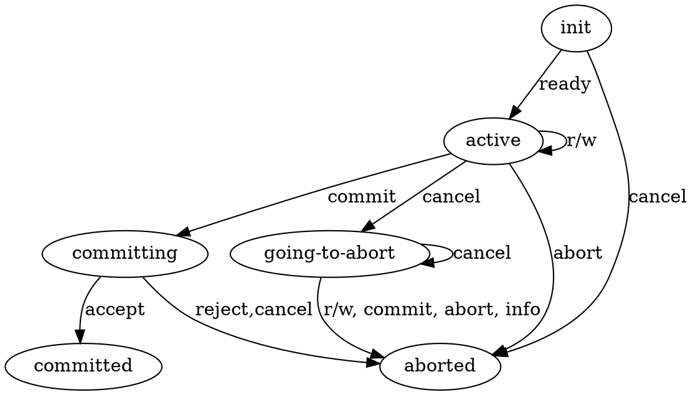

# SQL実行エンジンにおけるトランザクションの状態管理

## 本文書について

- 実行エンジンはトランザクションの状態や生存区間を管理する。(`jogasaki::transaction_context`オブジェクト) 
  - CCエンジンにおけるトランザクション状態に依存するが、そのものではなく完全には一致しない
- 本文書は実行エンジン視点でのトランザクション状態とその遷移について記述する

## トランザクション状態一覧

* init
  * トランザクションの開始前から、トランザクションハンドルを利用者に返すまでの状態 (初期状態)
* active
  * トランザクションのユーザ操作を受け付けている状態
* committing
  * トランザクションのコミット要求を受けコミット処理を開始し、まだ完了していない状態
* committed
  * トランザクションのコミットに成功した状態 (終了状態)
* aborted
  * トランザクションがアボートした状態 (終了状態)
* going-to-abort
  * トランザクションをアボートすべきだが、まだされていない可能性がある状態

## 操作一覧

* ready
  * トランザクションが開始され、トランザクションハンドルが利用可能になった
* r/w
  * トランザクション内の読み書き操作を行い、成功した
* cancel
  * ジョブのキャンセルがリクエストされ、それを受理した
* commit
  * コミットがリクエストされ、CCにコミットの開始を通達した
* abort
  * r/w 操作に失敗した、または明示的にアボートがリクエストされCCにその旨を通達した
* accept
  * CC がコミットを完了させた
* reject
  * CC がコミットを拒否した
* info
  * トランザクションの直近のエラー情報がリクエストされた

## 状態遷移マトリックス

| 状態 \ 操作 | ready | r/w | cancel | commit | abort | accept | reject | info |
| --- | --- | --- | --- | --- | --- | --- | --- | --- |
| init | active | - | aborted | - | - | - | - | - |
| active | - | active | going-to-abort | committing | aborted | - | - | - |
| committing | - | - | aborted[^1] | committing | aborted[^2] | committed | aborted | - |
| going-to-abort | - | aborted | going-to-abort | aborted | aborted | - | - | aborted |

[^1]: 正しく受理された場合のみabortedに遷移する。point-of-no-return を超えていた場合、キャンセル要求は受理されない
[^2]: 正しく受理された場合のみabortedに遷移する。point-of-no-return を超えていた場合、アボート要求は受理されない

## 状態遷移図

[状態遷移マトリックス](#状態遷移マトリックス) の主な部分を下記に示す(すべてを記述すると図が複雑になるため一部省略)。

(githubプレビューでは表示されない。Markdown Preview Enhanced を推奨)

