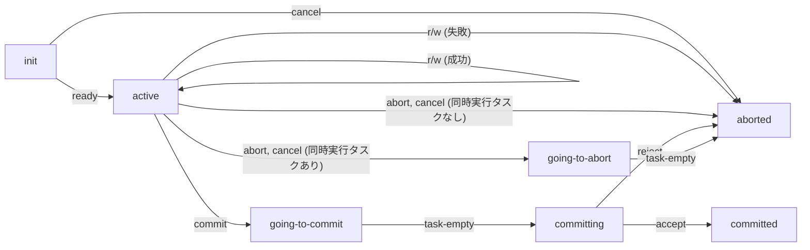

# SQL実行エンジンにおけるトランザクションの状態管理

## 本文書について

- 実行エンジンはトランザクションの状態や生存区間を管理する。(`jogasaki::transaction_context`オブジェクト) 
  - CCエンジンにおけるトランザクション状態に依存するが、そのものではなく完全には一致しない
- 本文書は実行エンジン視点でのトランザクション状態とその遷移について記述する

## トランザクション状態一覧

* init
  * トランザクションの開始前から、トランザクションハンドルを利用者に返すまでの状態 (初期状態)
* active
  * トランザクションのユーザ操作を受け付けている状態
* going-to-commit 
  * トランザクションのコミット要求を受けコミット処理を開始したが、まだCCへは要求していない状態
* committing
  * CCへコミット要求を行い、まだ完了していない状態
* committed
  * トランザクションのコミットに成功した状態 (終了状態)
* going-to-abort
  * トランザクションのアボート要求を受けアボート処理を開始したが、まだCCへは要求していない状態
* aborted
  * トランザクションがアボートした状態 (終了状態)

## 操作一覧

* ready
  * トランザクションが開始され、トランザクションハンドルが利用可能になった
* r/w
  * トランザクション内の読み書き操作を行った(成功または失敗)
* cancel
  * ジョブのキャンセルがリクエストされ、それを受理した
* commit
  * コミットがリクエストされ、(jogasakiでの) コミット処理を開始した
* task-empty
  * トランザクションを使用しているタスクの同時実行数が0になった
* abort
  * アボートがリクエストされ、それを受理した
* accept
  * CC がコミットを完了させた
* reject
  * CC がコミットを拒否した
* info
  * トランザクションの直近のエラー情報がリクエストされた

## 状態遷移マトリックス

| 状態 \ 操作 | ready | r/w | cancel | commit | abort | accept | reject | task-empty | info |
| --- | --- | --- | --- | --- | --- | --- | --- | --- | --- | 
| init | active | - | aborted | - | - | - | - | - | - | - |
| active | - | active/aborted [^4] | aborted/going-to-abort[^1] | going-to-commit | aborted/going-to-abort[^1] | - | - | - | - |
| going-to-commit | - | - [^2] | - [^2] | - [^2] | - [^2] | - | - | committing | - [^3] |
| going-to-abort | - | - [^2] | - [^2] | - [^2] | - [^2] | - | - | aborted | - [^5] |
| committing | - | - [^2] | - [^2] | - [^2] | - [^2] | committed | aborted | - | - [^3] |

[^1]: 実行中のタスクがあれば `going-to-abort` へ遷移、そうでなければ `aborted` へ遷移
[^2]: inactive transaction エラーとして通知
[^3]: コミット処理中として報告
[^4]: 操作が成功であれば `active` へ遷移、失敗であれば `aborted` へ遷移
[^5]: アボート済として報告 (コミット処理と異なりアボート確定)

## 状態遷移図

[状態遷移マトリックス](#状態遷移マトリックス) の主な部分を下記に示す

```mermaid
graph LR
  init -- ready --> active
  init -- cancel --> aborted
  active -- r/w (成功) --> active
  active -- r/w (失敗) --> aborted
  active -- commit --> going-to-commit
  active -- "abort, cancel (同時実行タスクなし)" --> aborted
  active -- "abort, cancel (同時実行タスクあり)" --> going-to-abort
  committing -- accept --> committed
  committing -- reject --> aborted
  going-to-abort -- "task-empty" --> aborted
  going-to-commit -- "task-empty" --> committing
```